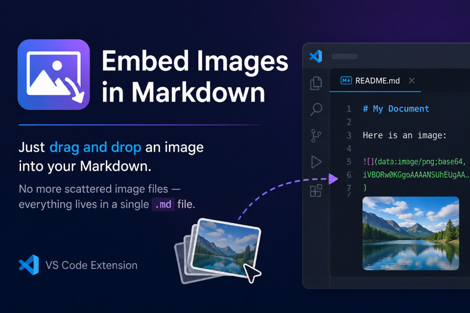

# Embed images in markdown

## Features

When a markdown file is open, dragging and dropping an image file with a `png`, `jpeg`, `jpg`, `gif`, or `webp` extension onto the text while holding down the `Shift` key will convert it to the DataUrl scheme and paste it into the markdown file.

At this time, the image is placed at the drop position in the form of a reference link, and the image file converted to the DataUrl scheme is expanded to the last line of the file.

## Requirements

- Visual sudio code version 1.125.0 or higher

Verified working on Windows. macOS and Linux are supported by design (all path-handling code guards on Windows-specific shapes and falls through to the standard cross-platform path otherwise) but have not been independently verified — feedback welcome.

## Contributing

Contributions are welcome!

## Known Issues

- Since VS Code 1.125.0, `markdown.editor.drop.enabled` is a string setting (`"always"`, `"smart"`, `"never"`) instead of a boolean. This setting only controls VS Code's own built-in Markdown link insertion and should not affect this extension, but if the built-in behavior interferes, set it to `"never"`.
- If you drag and drop multiple files at the same time, only one will be pasted.

## Release Notes

### 0.1.1

Switched package manager from npm to bun.

- Replaced `package-lock.json` with `bun.lock`.
- No user-facing behavior change.

### 0.1.0

Fixes drag-and-drop compatibility with VS Code 1.125.0 and later.

- Fixed: dropping an image no longer failed to insert on recent versions of VS Code.
- Fixed: on Windows, dropped images from the file explorer could be pasted with a broken image path.
- If a drop fails, you'll now see an error message instead of it failing silently.
- Requires VS Code 1.125.0 or higher.

### 0.0.5

- Support for macOS, Linux, WSL.

### 0.0.4

- add extension icon.

### 0.0.3

- Support for uppercase extensions.

### 0.0.2

- Drag and drop from Explorer view can now also be pasted.
- When multiple panes are open, you can now paste to the inactive editor pane.

### 0.0.1

- We confirmed that it works at a minimum.
